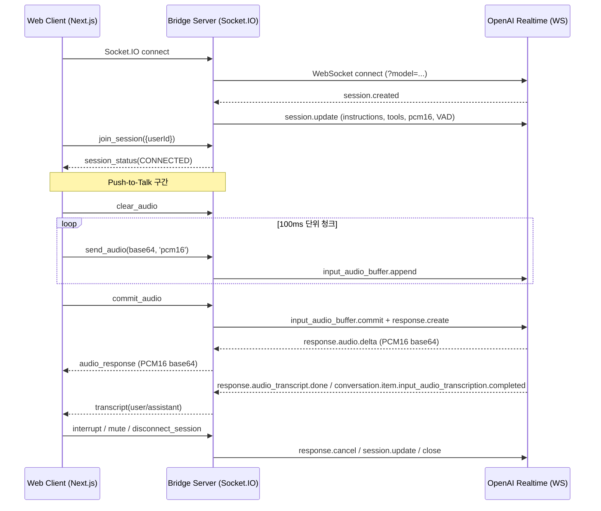

# 브릿지 서버 E2E 동작 가이드 + 언리얼 엔진 연동 가이드

이 문서는 브릿지 서버(Express/Socket.IO)와 클라이언트(Next.js 테스트 페이지)가 실제로 동작하는 전체 순서를 처음 보는 분도 이해할 수 있도록 단계별로 설명합니다. 또한 동일 브릿지 서버에 언리얼 엔진(UE) 클라이언트로 접속해 실시간 음성 대화를 구현하는 방법도 제시합니다.

## 1) 시스템 개요

- 프론트엔드(웹): 마이크 캡처 → PCM16(24kHz, 1ch)로 인코딩 → Socket.IO로 브릿지 서버에 전송
- 브릿지 서버: 클라이언트 세션 관리 → OpenAI Realtime API(WebSocket)와 프록시 연결 → 실시간 이벤트/오디오 중계
- OpenAI Realtime: 서버 VAD + 실시간 전사 + 실시간 음성 응답 생성



## 2) 브라우저 클라이언트: 단계별 동작

1. 유저 제스처(버튼 클릭) → 오디오 컨텍스트/마이크 권한 확보
   - getUserMedia로 마이크 스트림 획득
   - WebAudio로 24kHz 모노 PCM16으로 다운샘플링하며 100ms 단위 청크 생성
2. Socket.IO 연결
   - 서버 URL(예: http://localhost:8000)로 connect()
   - join_session({ userId }) 이벤트 송신 → 세션 룸 참여
3. 세션 준비
   - 서버가 OpenAI Realtime에 연결하고 session.update로 지침/도구/오디오/VAD 설정
   - 클라이언트는 session_status(CONNECTED) 수신
4. 음성 입력(PTT)
   - 시작 시 clear_audio
   - 녹음 중 100ms마다 PCM16 base64 청크를 send_audio(base64,'pcm16')로 송신
   - 종료 시 commit_audio → 서버가 OpenAI에 commit+response.create
5. 실시간 응답 수신/재생
   - 서버로부터 audio_response(PCM16 base64) 스트림 수신
   - 수신 즉시 PCM16을 재생(예: usePcm16Player) – AudioContext는 사용자 제스처 직후 resume()으로 활성화
6. 전사/이벤트 처리
   - transcript(user|assistant) 및 realtime_event 로깅/표시
7. 제어
   - interrupt로 현재 응답 중단(response.cancel)
   - mute(true|false)로 서버 VAD 끄고/켜기(session.update)
   - disconnect_session으로 세션 정리

### 주요 이벤트 요약
- 클라이언트 → 서버
  - join_session({ userId })
  - send_text(text)
  - send_audio(audioBase64, 'pcm16')
  - commit_audio, clear_audio
  - interrupt, mute(muted), disconnect_session
- 서버 → 클라이언트
  - session_status(status)
  - realtime_event(event)
  - audio_response(base64Pcm16)
  - transcript(text, role)
  - error({ message, code? })

## 3) 브릿지 서버: 단계별 동작

1. Socket.IO로 클라이언트 연결을 수신
2. join_session 수신 시 세션 생성, 룸 참여
3. OpenAI Realtime에 WebSocket 연결(wss://api.openai.com/v1/realtime?model=...)
4. session.update 전송
   - instructions(chatSupervisor 지침) + tools(chatSupervisor 도구)
   - input/output_audio_format = 'pcm16'
   - input_audio_transcription.model = 'gpt-4o-mini-transcribe'
   - turn_detection = server_vad (threshold, padding, silence, create_response)
5. 오디오 스트리밍
   - send_audio 수신 시 input_audio_buffer.append
   - commit_audio 시 input_audio_buffer.commit + response.create
6. 실시간 이벤트/오디오 중계
   - response.audio.delta → audio_response
   - 전사/메타 이벤트 → transcript, realtime_event
7. 제어/정리
   - interrupt → response.cancel
   - mute → session.update로 VAD on/off
   - disconnect_session → WS 종료, 세션 제거

## 4) 초보자를 위한 체크리스트

- 입력/출력 오디오 포맷은 모두 PCM16(24kHz, mono)로 통일
- 첫 사용자 제스처 후 오디오 컨텍스트 resume() 호출 필수(브라우저 자동재생 정책)
- 네트워크 탭/콘솔에서 다음 확인
  - 클→서: send_audio, commit_audio 발생
  - 서→클: audio_response, response.audio.delta 이벤트 수신
- 에러 발생 시 error({ message }) 이벤트로 메시지 표시

---

## 5) 언리얼 엔진(UE)에서의 연동 흐름

언리얼에서 동일 브릿지 서버에 접속해 실시간 음성 대화를 구현할 수 있습니다. 핵심은 Socket.IO로 동일한 이벤트를 송수신하고, PCM16(24kHz, mono)로 인코딩해 100ms 청크를 전송/재생하는 것입니다.

### 선택지 A: Socket.IO 클라이언트 플러그인 사용
- UE용 Socket.IO 클라이언트 플러그인(예: 커뮤니티 플러그인)을 프로젝트에 추가
- 블루프린트 또는 C++에서 다음 이벤트를 매핑
  - 연결: Connect(ServerUrl) → join_session({ userId })
  - 입력: 마이크 캡처 → PCM16(24kHz, mono) 변환 → base64 인코딩 → send_audio(base64,'pcm16')
  - PTT: 시작 시 clear_audio, 종료 시 commit_audio
  - 제어: interrupt, mute(true|false), disconnect_session
  - 수신: audio_response(base64)를 재생 버퍼에 누적, realtime_event, transcript UI 출력

### 선택지 B: WebSocket + 서버 변형
- Socket.IO 플러그인이 없으면 서버를 WebSocket 호환 레이어로 확장하거나, 어댑터를 추가해 기본 WS 프로토콜로 동일 이벤트를 전달하도록 구현할 수 있습니다. (현재 서버는 Socket.IO 표준을 사용하므로 A 권장)

### UE 오디오 파이프라인(권장 구현)
1. 마이크 캡처
   - AudioCapture 또는 오디오 입력 노드 사용
   - 24kHz 모노로 다운샘플(필요시 리샘플러 구현)
2. PCM16 인코딩
   - float(-1..1)을 int16 리틀엔디언으로 변환
   - 100ms 프레임 단위로 청크 생성 (예: 24000Hz → 2400 샘플/100ms)
3. 전송
   - 각 청크를 base64로 인코딩 → send_audio(base64, 'pcm16')
   - PTT 종료 시 commit_audio
4. 재생(수신)
   - audio_response(base64) 수신 시 base64→int16→float 변환
   - USoundWaveProcedural 또는 자체 오디오 큐에 푸시하여 끊김 없이 재생
   - 지터를 줄이기 위해 100~200ms 정도의 버퍼를 유지하는 지터 버퍼 권장

```mermaid
flowchart LR
    A[AudioCapture] --> B[Resample 24kHz Mono]
    B --> C[Float -> Int16 (PCM16 LE)]
    C --> D[Chunk 100ms -> Base64]
    D -->|send_audio| E[Socket.IO Client]
    E -->|commit_audio| F[Bridge Server]
    F -->|audio_response(base64)| G[Socket.IO Client]
    G --> H[Base64 -> Int16 -> Float]
    H --> I[USoundWaveProcedural Queue]
    I --> J[Audio Output]
```

### UE 구현 팁
- 실시간 재생 품질
  - 100ms 청크 기준으로 전송/재생, 수신 지연/순서 뒤바뀜 대비 재생 큐 사용
  - 재생 시작 전 최소 2~3 청크(200~300ms) 버퍼링 권장
- 스레드/타이밍
  - 네트워크 수신 콜백은 게임 스레드일 수 있어 오디오 렌더 스레드로 안전 전달
- 오류/복구
  - 연결 끊김 시 자동 재연결 + 세션 재참여 구현
  - 서버 error 이벤트를 HUD/로그에 출력해 원인 파악
- 포맷 일관성
  - 항상 PCM16(24kHz, mono) 유지 → 브릿지/모델 구성과 정합성 확보

## 6) 트러블슈팅 체크리스트(UE/웹 공통)
- 청크 크기: 100ms 기준(24kHz → 2400 샘플, 16bit mono → 약 4800바이트)
- Base64 인코딩/디코딩 시 바이트 정렬 확인(리틀엔디언)
- PTT 종료 후 반드시 commit_audio 호출
- 오디오가 들리지 않으면
  - 웹: 첫 사용자 제스처 후 AudioContext resume() 호출 여부
  - UE: 재생 큐 누적 여부, 샘플레이트 불일치 확인(재생 장치 48kHz라도 자동 리샘플)
- 서버 로그에서 response.audio.delta 이벤트가 들어오는지 확인

## 7) 레퍼런스
- 브릿지 서버 흐름/이벤트: `BRIDGE_SERVER_README.md`
- 테스트 페이지 E2E: `TEST_PAGE_E2E.md`
- 구현 상세 메모: `CORRECTED_APPROACH.md`

---
본 가이드를 따르면 웹/언리얼 클라이언트가 동일한 브릿지 서버에 접속하여 OpenAI Realtime 기반의 실시간 음성 대화를 안정적으로 구현할 수 있습니다.
