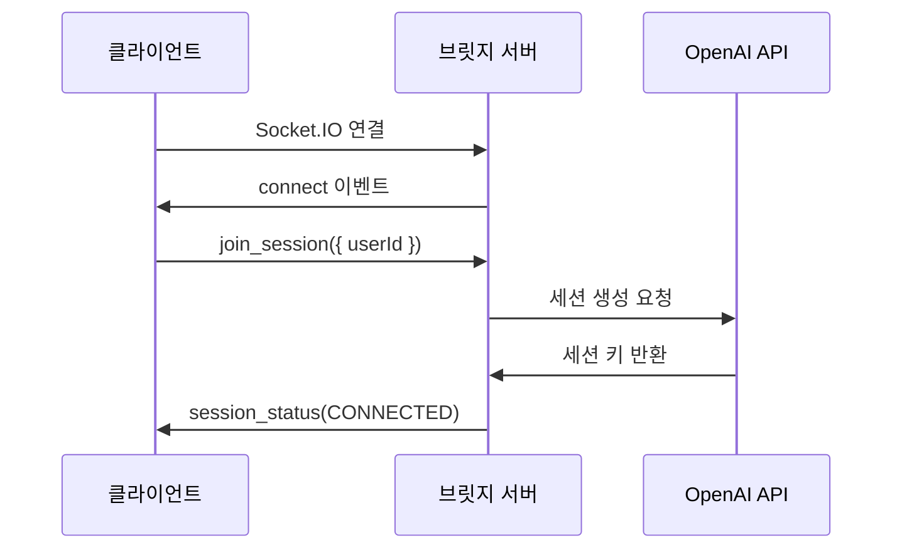
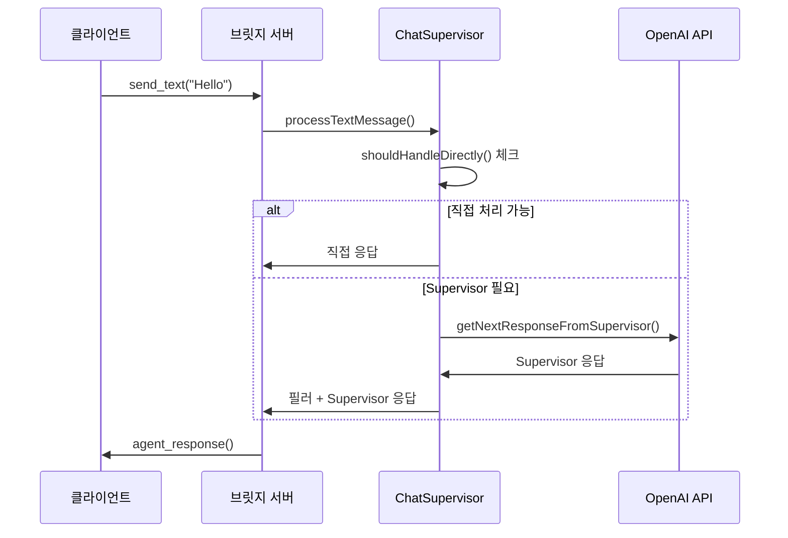
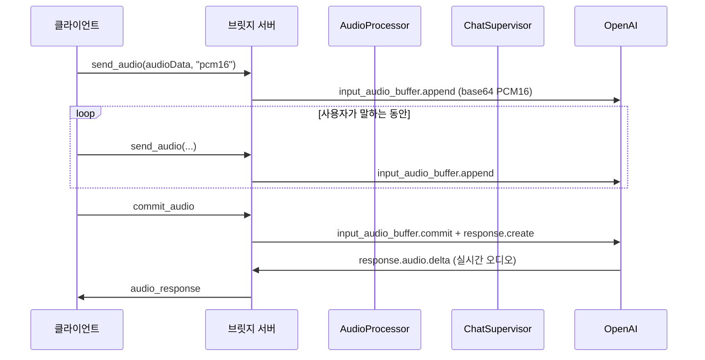

# OpenAI Realtime Agents 브릿지 서버

이 프로젝트는 기존 Next.js 기반 OpenAI Realtime Agents 애플리케이션을 분리하여 Express/Socket.IO 기반의 브릿지 서버를 구축한 것입니다. 프론트엔드와 백엔드를 분리하여 다양한 환경에서 동작할 수 있도록 설계되었습니다.

## 🏗️ 아키텍처 개요

```
┌─────────────────┐    Socket.IO     ┌─────────────────┐    HTTP/WebSocket    ┌─────────────────┐
│   Frontend      │ ◄──────────────► │  Bridge Server  │ ◄─────────────────► │   OpenAI API    │
│   (Next.js)     │                  │ (Express.js +   │                     │   (Realtime)    │
│                 │                  │  Socket.IO)     │                     │                 │
│ • Test Page     │                  │ • Session Mgmt  │                     │ • GPT-4 Model   │
│ • Audio Input   │                  │ • Audio Process │                     │ • Audio Stream  │
│ • Text Input    │                  │ • Agent Manager │                     │ • Tool Calling  │
│ • UI Components │                  │ • Chat Supervisor│                     │                 │
└─────────────────┘                  └─────────────────┘                     └─────────────────┘
```

## 📁 프로젝트 구조

```
openai-realtime-agents/
├── bridge-server/                  # 브릿지 서버 (새로 생성)
│   ├── src/
│   │   ├── index.ts               # 메인 서버 파일
│   │   ├── types/                 # 타입 정의
│   │   ├── services/              # 서비스 레이어
│   │   │   ├── SessionManager.ts  # 세션 관리
│   │   │   ├── AudioProcessor.ts  # 오디오 처리
│   │   │   └── OpenAIService.ts   # OpenAI API 통신
│   │   └── agents/                # 에이전트 관리
│   │       ├── AgentManager.ts    # 에이전트 매니저
│   │       └── ChatSupervisorAgent.ts # chatSupervisor 에이전트
│   ├── package.json
│   ├── tsconfig.json
│   └── env.example
├── src/app/
│   ├── hooks/                     # 브릿지 서버용 훅 (새로 생성)
│   │   ├── useBridgeSession.ts    # 브릿지 세션 관리
│   │   └── useBridgeAudio.ts      # 브릿지 오디오 처리
│   ├── test/                      # 테스트 페이지 (새로 생성)
│   │   └── page.tsx               # 브릿지 서버 테스트 UI
│   └── ... (기존 파일들)
└── ... (기존 구조)
```

## 🚀 설치 및 실행

### 1. 의존성 설치

#### 브릿지 서버
```bash
cd bridge-server
npm install
```

#### 프론트엔드 (socket.io-client 추가)
```bash
# 프로젝트 루트에서
npm install
```

### 2. 환경 변수 설정

#### 브릿지 서버 (.env)
```bash
cd bridge-server
cp env.example .env
```

`.env` 파일을 편집:
```
OPENAI_API_KEY=your_openai_api_key_here
PORT=8000
NODE_ENV=development
ALLOWED_ORIGINS=http://localhost:3000,http://localhost:3001
MAX_AUDIO_SIZE=10485760
AUDIO_SAMPLE_RATE=24000
AUDIO_CHANNELS=1
```

### 3. 서버 실행

#### 브릿지 서버 실행
```bash
cd bridge-server
npm run dev
```
서버가 `http://localhost:8000`에서 실행됩니다.

#### 프론트엔드 실행
```bash
# 프로젝트 루트에서
npm run dev
```
프론트엔드가 `http://localhost:3000`에서 실행됩니다.

### 4. 테스트 페이지 접속

브라우저에서 `http://localhost:3000/test`로 접속하여 브릿지 서버와의 통신을 테스트할 수 있습니다.

## 🔧 주요 기능

### 브릿지 서버

1. **세션 관리**
   - 클라이언트별 독립된 세션
   - 세션 생명주기 관리
   - 비활성 세션 자동 정리

2. **오디오 처리**
   - PCM16(권장), WAV, WebM 형식 지원
   - 실시간 오디오 스트리밍 (input_audio_buffer.append/commit)
   - 서버 VAD 기반 자동 응답 생성 구성(turn_detection)
   - 오디오 메타데이터 추출

3. **에이전트 시스템**
   - ChatSupervisor 에이전트 완전 이전
   - 기존 구조 및 로직 100% 유지
   - 주니어/시니어 에이전트 역할 분리

4. **OpenAI API 통합**
   - Realtime API 프록시
   - 세션 키 관리
   - 함수 호출 처리

### 프론트엔드 테스트 페이지

1. **연결 관리**
   - 서버 URL 설정
   - 사용자 ID 설정
   - 실시간 연결 상태 표시

2. **메시지 송수신**
   - 텍스트 메시지
   - 오디오 메시지 (녹음/재생)
   - 실시간 대화 기록

3. **오디오 기능**
   - 마이크 녹음
   - 실시간 음성 레벨 표시
   - 다양한 오디오 형식 지원

## 🎯 주요 개선사항

### 1. 아키텍처 분리
- **기존**: Next.js 서버 사이드에서 모든 처리
- **개선**: 프론트엔드와 백엔드 완전 분리
- **장점**: 확장성, 유지보수성, 다양한 클라이언트 지원

### 2. 실시간 통신
- **기존**: HTTP 요청/응답 기반
- **개선**: Socket.IO 기반 실시간 양방향 통신
- **장점**: 낮은 지연시간, 실시간 상호작용

### 3. 멀티 플랫폼 지원
- **기존**: 웹 전용
- **개선**: 모바일, 데스크톱 등 다양한 환경 지원 가능
- **장점**: 플랫폼 독립성

### 4. 독립적인 훅 시스템
- **기존**: 기존 훅과 혼재
- **개선**: 브릿지 서버 전용 훅 분리
- **장점**: 충돌 방지, 명확한 책임 분리

## 📋 API 명세

### Socket.IO 이벤트 (Realtime API 정합성)

#### 클라이언트 → 서버

| 이벤트 | 데이터 | 설명 |
|--------|--------|------|
| `join_session` | `{ userId?: string }` | 세션 참여 |
| `send_text` | `string` | 텍스트 메시지 전송 |
| `send_audio` | `Buffer \| string, format` | 오디오 데이터 전송 (format=`pcm16` 권장) |
| `interrupt` | - | 세션 중단 |
| `mute` | `boolean` | 음소거 설정 |
| `disconnect_session` | - | 세션 종료 |

#### 서버 → 클라이언트

| 이벤트 | 데이터 | 설명 |
|--------|--------|------|
| `session_status` | `BridgeSessionStatus` | 세션 상태 업데이트 |
| `message` | `BridgeMessage` | 메시지 수신 |
| `agent_response` | `any` | 에이전트 응답 |
| `transcript` | `string, role` | 음성 전사 결과 |
| `error` | `{ message, code? }` | 오류 발생 |

### HTTP 엔드포인트

| 메서드 | 경로 | 설명 |
|--------|------|------|
| `GET` | `/health` | 서버 상태 확인 |
| `POST` | `/api/session` | OpenAI 세션 생성 |

## 🔄 전체 통신 플로우

### 1. 연결 설정


### 2. 텍스트 메시지 처리


### 3. 오디오 메시지 처리


## 🎵 오디오 처리 상세

### 지원 형식
- **WAV**: 무손실 오디오 형식
- **WebM**: 브라우저 녹음 기본 형식
- **PCM16**: 원시 오디오 데이터

### 처리 과정
1. **입력**: 클라이언트에서 오디오 데이터 전송
2. **검증**: 크기 및 형식 유효성 검사
3. **변환**: 필요시 형식 변환 (향후 FFmpeg 통합 가능)
4. **메타데이터**: 샘플레이트, 재생시간 등 추출
5. **전달**: 에이전트로 처리 요청

## 🔧 개발자 가이드

### 새로운 에이전트 추가

1. `bridge-server/src/agents/` 에 새 에이전트 클래스 생성
2. `AgentManager.ts`에서 에이전트 등록
3. 필요한 도구 및 로직 구현

### 새로운 오디오 형식 지원

1. `AudioProcessor.ts`에서 새 형식 처리 로직 추가
2. 메타데이터 파싱 로직 구현
3. 필요시 변환 로직 추가

### 프론트엔드 커스터마이징

1. `useBridgeSession.ts` 훅을 사용하여 브릿지 서버 연결
2. `useBridgeAudio.ts` 훅을 사용하여 오디오 처리
3. 커스텀 UI 컴포넌트 개발

## 🐛 문제 해결

### 연결 문제
- 브릿지 서버가 실행 중인지 확인
- CORS 설정 확인 (ALLOWED_ORIGINS)
- 포트 충돌 확인

### 오디오 문제
- 브라우저 마이크 권한 확인
- 지원되는 오디오 형식인지 확인
- 네트워크 대역폭 확인

### API 키 문제
- OpenAI API 키가 올바른지 확인
- API 사용량 한도 확인
- 환경변수 설정 확인

## 📈 성능 최적화

### 서버 측
- 세션 풀링
- 오디오 데이터 압축
- 비활성 세션 정리
- 메모리 사용량 모니터링

### 클라이언트 측
- 오디오 버퍼링
- 재연결 로직
- 오류 처리 강화
- UI 반응성 최적화

## 🔮 향후 계획

### 단기 (1-2개월)
- [ ] FFmpeg 통합으로 오디오 형식 변환 개선
- [ ] WebRTC 직접 통합 검토
- [ ] 에이전트 성능 모니터링 대시보드
- [ ] 단위 테스트 추가

### 중기 (3-6개월)
- [ ] 클러스터링 지원
- [ ] Redis 기반 세션 저장소
- [ ] 모바일 SDK 개발
- [ ] 실시간 분석 기능

### 장기 (6개월+)
- [ ] 마이크로서비스 아키텍처 전환
- [ ] AI 모델 로컬 호스팅 옵션
- [ ] 다국어 지원
- [ ] 엔터프라이즈 기능 (SSO, 감사로그 등)

## 🤝 기여 방법

1. 이슈 리포트
2. 기능 제안
3. 코드 기여
4. 문서 개선

## 📄 라이선스

이 프로젝트는 원본 OpenAI Realtime Agents 프로젝트의 라이선스를 따릅니다.

---

## 🎉 결론

이 브릿지 서버 구현을 통해 기존 Next.js 기반 애플리케이션을 성공적으로 분리하여:

1. **확장성** 향상 - 다양한 클라이언트 지원
2. **유지보수성** 개선 - 명확한 책임 분리
3. **성능** 최적화 - 실시간 통신 및 효율적인 리소스 사용
4. **호환성** 유지 - 기존 chatSupervisor 로직 100% 보존

브릿지 서버는 현대적인 아키텍처 패턴을 따르면서도 기존 시스템의 안정성을 보장하는 솔루션입니다.
