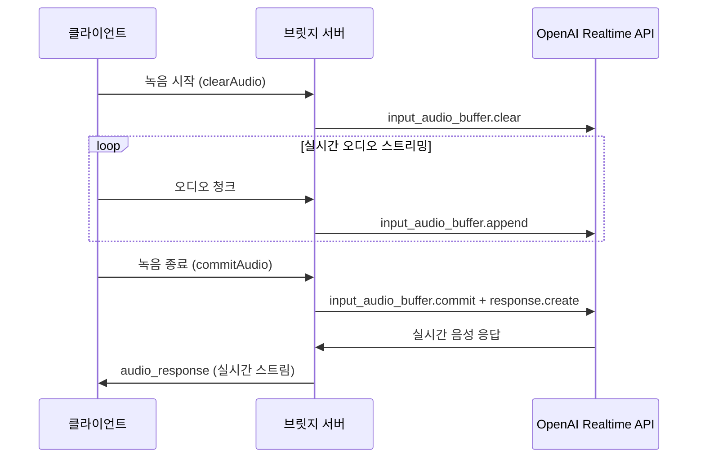
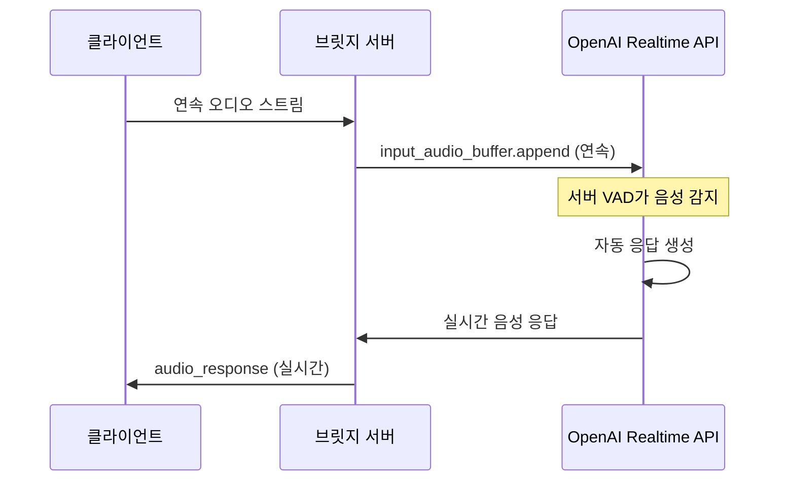

# 브릿지 서버 수정: OpenAI Realtime API 올바른 접근법

## 🎯 문제점 및 수정 사항

### ❌ 기존 잘못된 접근법
```typescript
// 불필요한 Whisper API 단계
클라이언트 음성 → Socket.IO → Whisper API → 텍스트 → chatSupervisor → 텍스트 응답
```

### ✅ 올바른 OpenAI Realtime API 접근법
```typescript
// 실시간 음성 스트리밍
클라이언트 음성 → Socket.IO → OpenAI Realtime API → 실시간 음성 응답
```

## 🔧 주요 수정 사항

### 1. **RealtimeProxyService 생성**
- OpenAI Realtime API WebSocket 직접 연결
- 클라이언트 ↔ 브릿지 서버 ↔ OpenAI API 실시간 프록시
- Whisper 변환 단계 제거

```typescript
// bridge-server/src/services/RealtimeProxyService.ts
export class RealtimeProxyService extends EventEmitter {
  private openaiWs: WebSocket | null = null;
  
  async connect(): Promise<void> {
    const wsUrl = 'wss://api.openai.com/v1/realtime';
    this.openaiWs = new WebSocket(wsUrl, {
      headers: {
        'Authorization': `Bearer ${this.apiKey}`,
        'OpenAI-Beta': 'realtime=v1'
      }
    });
  }
  
  sendAudioToOpenAI(audioData: Buffer): void {
    const base64Audio = audioData.toString('base64');
    this.sendToOpenAI({
      type: 'input_audio_buffer.append',
      audio: base64Audio
    });
  }
}
```

### 2. **메인 서버 로직 수정**
```typescript
// bridge-server/src/index.ts
socket.on('join_session', async (data) => {
  // RealtimeProxyService 생성
  realtimeProxy = new RealtimeProxyService({
    apiKey: process.env.OPENAI_API_KEY!,
    sessionId: sessionId
  });
  
  // 실시간 이벤트 프록시
  realtimeProxy.on('openai_message', (message) => {
    socket.emit('realtime_event', message);
  });
  
  await realtimeProxy.connect();
});

socket.on('send_audio', async (audioData, format) => {
  // OpenAI Realtime API로 직접 전송 (실시간 스트리밍)
  realtimeProxy.sendAudioToOpenAI(audioBuffer);
});
```

### 3. **프론트엔드 훅 개선**
```typescript
// src/app/hooks/useBridgeSession.ts
export interface BridgeSessionCallbacks {
  onAudioResponse?: (audioData: string) => void; // 실시간 오디오 스트림
  onRealtimeEvent?: (event: any) => void; // OpenAI Realtime API 이벤트
}

// 새로운 메서드
const commitAudio = () => socket.emit('commit_audio');
const clearAudio = () => socket.emit('clear_audio');
```

```typescript
// src/app/hooks/useBridgeAudio.ts (PCM16 스트리밍)
const ds = downsampleBuffer(inputFloat32, ctx.sampleRate, 24000);
const pcm16 = floatTo16BitPCM(ds);
callbacks.onAudioChunk?.(pcm16); // base64 인코딩은 호출부에서 처리
```

### 4. **테스트 페이지 업데이트**
```typescript
// src/app/test/page.tsx
const audioCallbacks = {
  onAudioChunk: async (audioData: ArrayBuffer) => {
    const base64 = btoa(String.fromCharCode(...new Uint8Array(audioData)));
    sendAudio(base64, 'pcm16');
  },
  
  onRecordingStart: () => clearAudio(),
  onRecordingStop: () => commitAudio(),
};

const bridgeCallbacks = {
  onAudioResponse: (audioData: string) => {
    // 실시간 오디오 응답 처리
  },
  onRealtimeEvent: (event: any) => {
    // OpenAI Realtime API 이벤트 처리
  }
};
```

## 🎵 올바른 음성 처리 플로우

### **Push-to-Talk 방식**


### **Voice Activity Detection (VAD) 방식**


## 🚀 주요 개선점

### **1. 성능 향상**
- **지연시간 단축**: Whisper 변환 단계 제거로 지연시간 최소화
- **대역폭 효율**: 실시간 스트리밍으로 버퍼링 최소화
- **CPU 사용량 감소**: 서버 측 음성 처리 부담 제거

### **2. 자연스러운 대화**
- **실시간 응답**: 음성 입력과 응답 간의 자연스러운 흐름
- **중단 기능**: 응답 중 사용자 발화로 중단 가능
- **VAD 지원**: 자동 음성 감지 및 응답

### **3. OpenAI 기능 완전 활용**
- **음성 품질**: OpenAI의 고품질 TTS 직접 활용
- **다양한 음성**: 여러 음성 옵션 지원 (sage, alloy 등)
- **실시간 전사**: 선택적 음성 전사 기능

### **4. 확장성**
- **코덱 지원**: PCM16, Opus 등 다양한 오디오 형식
- **세션 관리**: 멀티 세션 동시 처리
- **이벤트 기반**: 실시간 이벤트 처리로 반응성 향상

## 📋 새로운 이벤트 체계

### **클라이언트 → 서버**
| 이벤트 | 데이터 | 설명 |
|--------|--------|------|
| `send_audio` | `Buffer/string, format` | 실시간 오디오 청크 |
| `commit_audio` | - | 오디오 입력 커밋 (PTT 종료) |
| `clear_audio` | - | 오디오 버퍼 클리어 |
| `send_text` | `string` | 텍스트 메시지 |

### **서버 → 클라이언트**
| 이벤트 | 데이터 | 설명 |
|--------|--------|------|
| `realtime_event` | `OpenAIEvent` | OpenAI API 원시 이벤트 |
| `audio_response` | `string` | Base64 오디오 스트림 |
| `transcript` | `string, role` | 실시간 음성 전사 |

## 🎯 chatSupervisor Agent 통합

기존 chatSupervisor 로직은 OpenAI Realtime API의 **시스템 프롬프트**와 **도구 호출**로 완전히 대체됩니다:

```typescript
// RealtimeProxyService에서 세션 초기화
this.sendToOpenAI({
  type: 'session.update',
  session: {
    model: 'gpt-4o-realtime-preview-2025-06-03',
    voice: 'sage',
    instructions: `
      You are a helpful junior customer service agent for NewTelco.
      ${chatSupervisorInstructions}
    `,
    tools: chatSupervisorTools, // 기존 도구들
    // VAD 설정
    turn_detection: {
      type: 'server_vad',
      threshold: 0.9,
      prefix_padding_ms: 300,
      silence_duration_ms: 500,
      create_response: true
    }
  }
});
```

## 🏆 결론

이제 브릿지 서버가 **OpenAI Realtime API의 진정한 장점**을 활용합니다:

1. **⚡ 실시간 음성 대화** - 지연시간 최소화
2. **🎯 자연스러운 흐름** - 중단 및 VAD 지원  
3. **🔧 완전한 프록시** - 불필요한 변환 과정 제거
4. **📈 확장 가능** - 다양한 클라이언트 환경 지원

브릿지 서버는 이제 단순한 **WebSocket 프록시** 역할을 하면서도 세션 관리, 로깅, 모니터링 등의 부가 기능을 제공하는 완전한 솔루션이 되었습니다! 🎉
